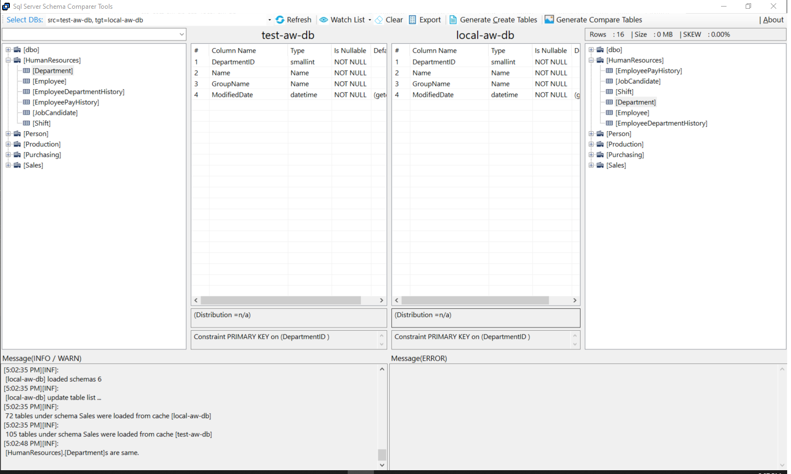
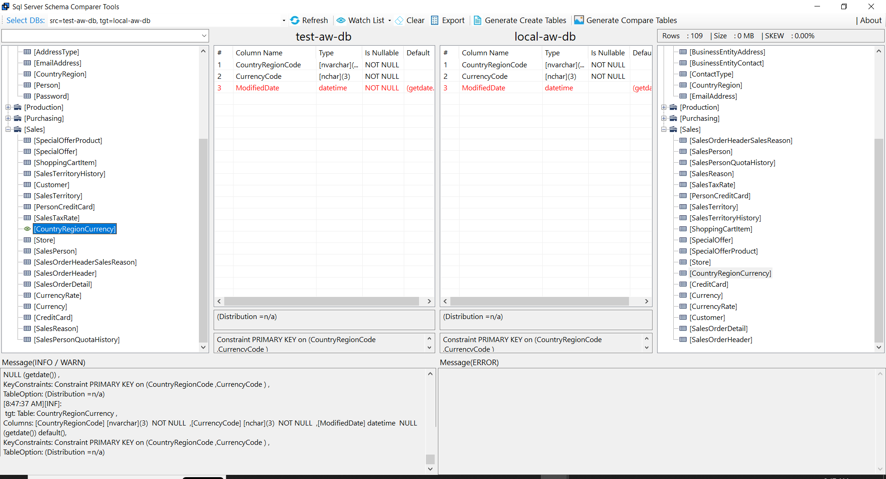
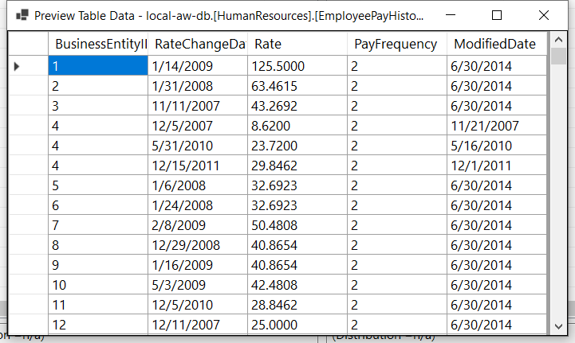
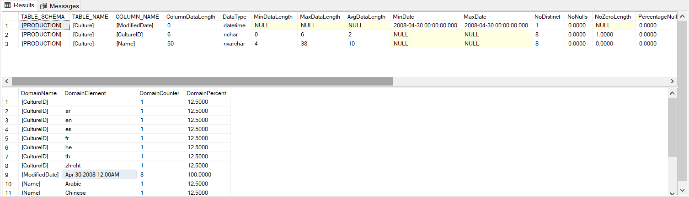
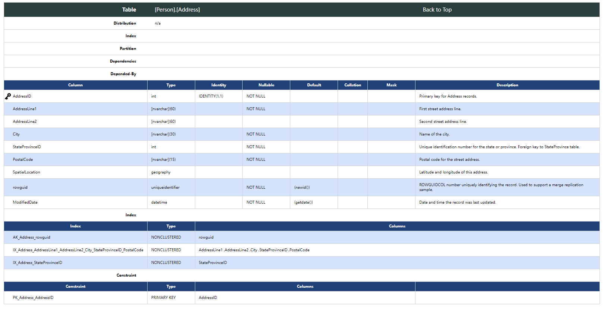
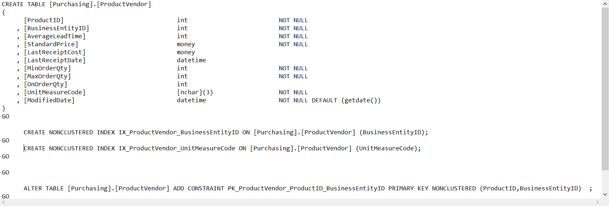
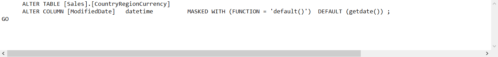

# SchemaComparer.GUI

[toc]

## 1. Introduction

**SchemaComparer.GUI.exe** is a windows desktop application. It's designed to help user quickly understand database structure and easily find gaps of 2 databases:

- To explore schemas and tables of a specific database
- To explore the database gaps between 2 different environments

Now, as days went by, we brought more features to enhance it.

## 2. Why we build it?

Sometimes when we engineers are working on a database project, no matter is it  a business repository , or a data warehouse for BI, we always need to quickly understand what residents in the box -- schemas , tables, columns , and how the data is like.

No doubt it's boring to do it by handing-on code, which is easily to fail or fault. So we built this tool to entitle engineers a more convenient way to complete their job.  

Thanks to Danny Xiang, who initiated this work! 

## 3. Features

| #    | Features                                                     | Comments                 |
| ---- | ------------------------------------------------------------ | ------------------------ |
| F1   | List schemas and tables as a tree view                       | Informative              |
| F2   | List columns information                                     | Informative              |
| F3   | Display table partition, constraints and distribution(DW only) | Informative              |
| F4   | Display right table summary, including rows count, table size and SKEW(DW  only) | Informative              |
| F5   | Auto locate table with the same name in the right part       | Ops                      |
| F6   | Compare/Batch Compare tables and highlight table differences | Find gaps                |
| F7   | Find same name columns in all tables                         | In case of type mismatch |
| F8   | Generate Html Documents for schemas                          | Schema overview          |
| F9   | Generate Gap amendment script for tables                     | DBA tool                 |
| F10  | Tables can be added into 'watch list' and can be removed out. | Ops                      |
| F11  | Generate Create Tables script for tables in 'watch list'     | DBA tool                 |
| F12  | Export 'watch list'                                          | Ops                      |
| F13  | Find table by fuzzy name                                     | Ops                      |
| F14  | Preview table data                                           | DBA tool                 |
| F15  | Profile table data (TBD)                                     | DBA tool                 |

### 3.1 Display Information

1. [Both] (F1) Schema and Tables tree
2. [Both] (F2, F3) Columns, Keys, Indexes and Table Info: partition, distribution 
3. [Both] (F6) Difference between same tables of both sides
4. [Right] (F4) Table Summary with rows , size and skew rate (synapse)

### 3.2 Columns exploring

1. [Both] (F7) By double clicking a column, to find all same name columns in all tables, to compare their type and column properties

It'll be useful when the column types found are not same or even compatible. Like '`CreateDate`', sometimes it's `datetime` type, sometimes it's `int` format as '`yyyyMMdd`'. It'll bring incompatible when linking the two columns together for table joins. By this way, we can easily identify what causes the problem. 

### 3.3 Preview Data

1. [Left] (F14) By right-click on a left table, choose a table and preview it's data of first 1000 rows.

We can easily explore the data in a table by one click, to avoid boring  script code typing.  

### 3.4 Profile table data (TBD)

[Both] (F15) By right-click on a left table, choose a table and profile it's data.

Reference : [Data Profiling with T-SQL – SQLServerCentral](https://www.sqlservercentral.com/articles/data-profiling-with-t-sql)

** This feature is in developing yet.

### 3.5 Export Html Documents

[LEFT] (F8) Export the metadata as HTML documents

The output html files are organized by schema names.  Each file contains all tables metadata information, including table columns with properties, such as is_key, name, type, identity, nullable, default value, collation, mask and description, including table indexes, constraints, partitions and distribution(Synapse DW) information. 

This is much more understandable than it's in SSMS or other developer's IDE. 

Even better, we provide a dependencies link if we can define them in a reference file (I'll bring it in another article)

### 3.6 Generate Create-tables script

[LEFT] (F11) Add some tables into watch list and Generate Create-table scripts with their indexes and constraints

(TBD) Table Partitions are in Task queues, not ready now!

(**issues** here:  some abandoned 'Create' words)

### 3.7 Generate Table Delta Script

 [LEFT] (F9) Add some tables into watch list and Generate Compare-table scripts 

This means we can eliminates the gap between tables in 2 environments. 

This feature is much complex when we consider data cannot loss when we change the table structure. I'll left the explanation later.  

## 4. Function underneaths

- When program is starting, it'll load metadata of select databases, specified schemas ( in config) into cache file, then visualize them on WinForms .

- The selected databases are configured in the configuration file. Usually we set 2 ~ 4 database connections of different environments, which will be brought for comparing.
- In case the database are too complex to load fast, we  can add some schemas in '`focusSchemas`' section, which will constrain the schemas to populate.
- The cache files are json format, can be quicker loaded when we're comparing schemas. The cache will be expired in 10 minutes by default.
- The cache files are independent by database name and schema name.
- Metadata Html Documents are generated based on a RAZOR template file, which is at the path as configured.
- Support either **Synapse DW** or **Sql Database**, by selecting an `ISqlCommandText` instance (`SynapseSqlCommandText`, or `SqlDatabaseCommandText`), 
- Support lineage dependency navigation on html doc. The dependency is referenced in '`reference`' configuration section

## 5. Core Queries

For SQL Server or Azure SQL , the following code will collect metadata, including table schema , table name , columns , indexes, primary key, masking, partitions and table summary.   

~~~c#

	public static class SqlServerCmdTextConstant
	{
		public static readonly string cmd_get_schema = @"
SELECT DISTINCT
         a.NAME			AS [schema_name]
       , a.schema_id	AS [schema_id]
FROM   sys.schemas a
       INNER JOIN sys.objects b
               ON a.schema_id = b.schema_id
ORDER  BY a.NAME
";

		public static readonly string cmd_get_table = @"
	SELECT t.object_id   AS table_id,
		   sch.[name]    AS table_schema,
		   t.[name]      AS table_name,
		   i.[type_desc] AS index_type
	FROM   sys.tables t
		   INNER JOIN sys.schemas AS sch
				   ON sch.schema_id = t.schema_id
		   LEFT JOIN sys.indexes i
				  ON t.[object_id] = i.[object_id]
					 AND i.[index_id] <= 1
	WHERE  (sch.[name] = @table_schema or @table_schema is null)
		   AND (t.[name] = @table_name  or @table_name is null )

";

		public static readonly string cmd_get_table_key_constraint = @"
	SELECT stable.object_id AS table_id,
		   stable.NAME      AS table_name,
		   sschema.NAME     AS table_schema,
		   skc.NAME         AS key_name,
		   skc.object_id    AS key_id,
		   CASE
			 WHEN skc.type = 'pk' THEN 'PRIMARY KEY'
			 WHEN skc.type = 'uq' THEN 'UNIQUE'
			 ELSE skc.type
		   END              AS key_type,
		   CASE
			 WHEN skc.is_enforced = 1 THEN ''
			 ELSE 'NOT ENFORCED'
		   END              AS not_enforced,
		   sindex.type_desc AS index_type,
		   scolumn.NAME     AS column_name,
		   CASE
			 WHEN sicolumn.is_descending_key = 1 THEN 'DESC'
			 ELSE 'ASC'
		   END              AS column_ascend
	FROM   sys.key_constraints AS skc
		   INNER JOIN sys.tables AS stable
				   ON stable.object_id = skc.parent_object_id
		   LEFT JOIN sys.indexes AS sindex
				  ON sindex.object_id = skc.parent_object_id
					 AND sindex.NAME = skc.NAME
		   LEFT JOIN sys.index_columns AS sicolumn
				  ON sicolumn.object_id = skc.parent_object_id
					 AND sicolumn.index_id = sindex.index_id
		   LEFT JOIN sys.columns AS scolumn
				  ON scolumn.object_id = skc.parent_object_id
					 AND scolumn.column_id = sicolumn.column_id
		   INNER JOIN sys.schemas AS sschema
				   ON sschema.schema_id = stable.schema_id
	WHERE  sschema.NAME = @table_schema
		   AND (stable.NAME = @table_name or @table_name is null)

";

		public static readonly string cmd_get_table_column = @"
	DECLARE @db_collation NVARCHAR(128)

	SET @db_collation = (SELECT collation_name
						 FROM   sys.databases
						 WHERE  NAME = Db_name())
	;

	WITH  tcolumn AS
		  (SELECT stable.object_id            AS [table_id],
					scolumn.[column_id]         AS [column_id],
					sschema.[name]              AS [table_schema],
					stable.[name]               AS [table_name],
					scolumn.[name]              AS [column_name],
					stype.[name]                AS [data_type],
					scolumn.[max_length]        AS [max_length],
					scolumn.[precision]         AS [precision],
					scolumn.[scale]             AS [scale],
					CASE
                       WHEN ix_col.object_id IS null then ''
					   ELSE 'YES' end			AS [is_key],
					CASE
					  WHEN stype.[name] IN ( 'decimal', 'numeric' ) THEN
					  stype.NAME + '('
					  + Cast(scolumn.PRECISION AS VARCHAR(8))
					  + ',' + Cast(scolumn.[scale] AS VARCHAR(8))
					  + ')'
					  WHEN scolumn.max_length < 0 THEN stype.NAME + '(max)'
					  WHEN stype.NAME IN ( 'char', 'varbinary', 'varchar' ) THEN
					  stype.NAME + '('
					  + Cast(scolumn.max_length AS VARCHAR(8))
					  + ')'
					  WHEN stype.NAME IN ( 'nchar', 'nvarchar' ) THEN
					  stype.NAME + '('
					  + Cast(scolumn.max_length/2 AS VARCHAR(8))
					  + ')'
					  ELSE stype.[name]
					END                         AS type_string
					--,isnull(scolumn.[collation_name],'') as collation_name
					,
					CASE
					  WHEN scolumn.collation_name <> @db_collation THEN
					  scolumn.collation_name
					  ELSE ''
					END                         AS collation_name,
					CASE
					  WHEN scolumn.[is_nullable] = 1 THEN 'NULL'
					  ELSE 'NOT NULL'
					END                         AS nullable,
					CASE
					  WHEN scolumn.[is_identity] = 1 THEN
					  'IDENTITY('
					  + Cast(idnt.seed_value AS VARCHAR(16)) +
					  ','
					  + Cast(idnt.increment_value AS VARCHAR(16)
					  )
					  + ')'
					  ELSE ''
					END                         AS identity_string,
					scolumn.[default_object_id] AS [default_object_id],
					dc.[definition]				AS [default_definition],
					scolumn.[is_masked]         AS [is_masked],
					mc.masking_function			AS [masking_function],
					sep.Value				    AS [description]

			 FROM   sys.columns AS scolumn
					INNER JOIN sys.tables AS stable
							ON stable.[object_id] = scolumn.[object_id]
					INNER JOIN sys.schemas AS sschema
							ON sschema.[schema_id] = stable.[schema_id]
					INNER JOIN sys.types AS stype
							ON scolumn.system_type_id = stype.system_type_id
							   AND scolumn.user_type_id = stype.user_type_id
					LEFT JOIN sys.indexes ix  -- for primary key
                            ON ix.object_id = stable.[object_id] and ix.is_primary_key=1
					LEFT JOIN sys.index_columns ix_col
                            on ix.index_id = ix_col.index_id
								AND  ix_col.object_id = stable.[object_id]
								AND  ix_col.column_id = scolumn.column_id
					LEFT JOIN sys.identity_columns AS idnt
						   ON idnt.[object_id] = scolumn.[object_id]
							  AND idnt.column_id = scolumn.column_id
                    LEFT JOIN  SYS.default_constraints dc
					       on scolumn.[default_object_id] = dc.[object_id]
                    LEFT JOIN  SYS.masked_columns mc
					       on stable.[object_id] = mc.[object_id] and scolumn.column_id = mc.column_id
					LEFT JOIN sys.extended_properties sep on stable.object_id = sep.major_id
                                         and scolumn.column_id = sep.minor_id
										 and [class] = 1
                                         and sep.name = 'MS_Description'
			 WHERE  stable.type = 'u')
	SELECT *
	FROM   tcolumn
	WHERE   table_schema = @table_schema
		   AND (table_name = @table_name or @table_name is null)

	ORDER  BY column_id
";

		/// 

		/// including both primary index and other index
		/// 

		/// <remarks>
		///  IN CASE index type ='heap', there is no column joined, so use 'left join'
		/// </remarks>
		public static readonly string cmd_get_table_index = @"
WITH ti
     AS (SELECT sindex.object_id AS table_id,
                sschema.NAME     AS table_schema,
                stable.NAME      AS table_name,
                sindex.NAME      AS index_name,
                sindex.type_desc AS index_type,
				CASE
					WHEN sindex.[IS_UNIQUE] = 1 THEN 'UNIQUE'
					ELSE '' END AS [UNIQUE_EXP],
                scolumn.NAME     AS column_name,
                sicolumn.key_ordinal,
				sindex.index_id,
                CASE
                  WHEN sicolumn.is_descending_key = 1 THEN 'DESC'
                  ELSE 'ASC'
                END              AS column_ascending,
                sds.NAME         AS data_space
         FROM   sys.indexes AS sindex
                INNER JOIN sys.tables AS stable
                        ON stable.object_id = sindex.object_id
                INNER JOIN sys.schemas AS sschema
                        ON sschema.schema_id = stable.schema_id
                LEFT JOIN [sys].[index_columns] AS sicolumn
                        ON sicolumn.object_id = sindex.object_id
                           AND sicolumn.index_id = sindex.index_id
                LEFT JOIN sys.columns AS scolumn
                        ON scolumn.object_id = sindex.object_id
                           AND scolumn.column_id = sicolumn.column_id
                LEFT JOIN sys.data_spaces AS sds
                       ON sds.data_space_id = sindex.data_space_id
         WHERE  1=1
				AND sindex.is_unique_constraint = 0
                AND sindex.is_primary_key = 0
				 )
SELECT *
FROM   ti
WHERE   ti.table_schema = @table_schema
       AND (ti.table_name = @table_name or @table_name is null)
ORDER  BY ti.table_schema,
          ti.table_name,
          ti.index_name,
          ti.key_ordinal
";

		public static readonly string cmd_get_table_partition = @"
	SELECT o.[object_id]								 AS [table_id],
		   s.[name]                                      AS [TABLE_SCHEMA],
		   o.[name]                                      AS [TABLE_NAME],
		   c.[name]                                      AS [COLUMN_NAME],
		   ( CASE
			   WHEN pf.[boundary_value_on_right] = 1 THEN 'right'
			   ELSE 'left'
			 END )                                       AS [BOUNDARY_TYPE],
		   (SELECT String_agg(Cast(prv.[value] AS VARCHAR), ',')
			FROM   sys.partition_range_values prv
			WHERE  prv.[function_id] = ps.[function_id]) AS [BOUNDARY_VALUES]
	FROM   sys.objects o
		   INNER JOIN sys.schemas s
				   ON s.[schema_id] = o.[schema_id]
		   INNER JOIN sys.indexes i
				   ON i.[object_id] = o.[object_id]
		   INNER JOIN sys.index_columns ic
				   ON ic.[object_id] = o.[object_id]
					  AND ic.[index_id] = i.[index_id]
					  AND ic.[partition_ordinal] >= 1
		   INNER JOIN sys.columns c
				   ON c.object_id = o.object_id
					  AND c.[column_id] = ic.[column_id]
		   INNER JOIN sys.data_spaces ds
				   ON ds.[data_space_id] = i.[data_space_id]
		   INNER JOIN sys.partition_schemes ps
				   ON ps.[data_space_id] = i.[data_space_id]
		   INNER JOIN sys.partition_functions pf
				   ON ps.[function_id] = pf.[function_id]
	WHERE  s.[name] = @table_schema  AND (o.[name] = @table_name or @table_name is null)
";

		public static readonly string cmd_get_table_summary = @"

SELECT
	s.Name											AS [table_schema],
	t.Name											AS [table_name],
	t.OBJECT_ID										AS [table_id],
	p.Rows											AS [total_row_count],
	CAST(ROUND((SUM(a.used_pages) / 128.00), 2)	AS NUMERIC(36, 2))
												    AS [Used_MB],
	CAST(ROUND((SUM(a.total_pages) - SUM(a.used_pages)) / 128.00, 2) AS NUMERIC(36, 2))
												    AS [Unused_MB],
	CAST(ROUND((SUM(a.total_pages) / 128.00), 2) AS NUMERIC(36, 2))
												    AS  [total_size_MB]
FROM sys.tables t
	INNER JOIN sys.indexes i ON t.OBJECT_ID = i.object_id
	INNER JOIN sys.partitions p ON i.object_id = p.OBJECT_ID AND i.index_id = p.index_id
	INNER JOIN sys.allocation_units a ON p.partition_id = a.container_id
	INNER JOIN sys.schemas s ON t.schema_id = s.schema_id
WHERE  s.[name] = @table_schema  AND (t.[name] = @table_name or @table_name is null)
GROUP BY t.Name, t.OBJECT_ID, s.Name, p.Rows
ORDER BY s.Name, t.Name

";
	}

~~~

For synapse , some differences, such as distribution:

~~~c#
	public static class SynapseCmdTextConstant
	{
		public static readonly string cmd_get_table_distribution = @"
	declare @isSqlDW bit
	set  @isSqlDW = case when @@version like '%warehouse%' then 1 else 0 end
	if(@isSqlDW = 1)
	begin

	SELECT t.object_id                   AS [table_id],
		   sch.NAME                      AS [table_schema],
		   t.NAME                        AS [table_name],
		   tp.[distribution_policy_desc] AS [distribution_policy],
		   Isnull(c.[name], '')          AS [distribution_column]
	FROM   sys.tables t
		   INNER JOIN sys.schemas AS sch
				   ON sch.schema_id = t.schema_id
		   LEFT JOIN sys.pdw_table_distribution_properties tp
				  ON t.[object_id] = tp.[object_id]
		   LEFT JOIN (SELECT *
					  FROM   sys.pdw_column_distribution_properties
					  WHERE  distribution_ordinal = 1) cdp
				  ON t.[object_id] = cdp.[object_id]
		   LEFT JOIN sys.columns c
				  ON cdp.[object_id] = c.[object_id]
					 AND cdp.[column_id] = c.[column_id]
	WHERE  (sch.NAME = @table_schema  AND t.NAME = @table_name ) or (@table_name is null)

	end

";

		public static readonly string cmd_get_table_partition = @"
	SELECT o.[object_id]								 AS [table_id],
		   s.[name]                                      AS [TABLE_SCHEMA],
		   o.[name]                                      AS [TABLE_NAME],
		   c.[name]                                      AS [COLUMN_NAME],
		   ( CASE
			   WHEN pf.[boundary_value_on_right] = 1 THEN 'right'
			   ELSE 'left'
			 END )                                       AS [BOUNDARY_TYPE],
		   (SELECT String_agg(Cast(prv.[value] AS VARCHAR), ',')
			FROM   sys.partition_range_values prv
			WHERE  prv.[function_id] = ps.[function_id]) AS [BOUNDARY_VALUES]
	FROM   sys.objects o
		   INNER JOIN sys.schemas s
				   ON s.[schema_id] = o.[schema_id]
		   INNER JOIN sys.indexes i
				   ON i.[object_id] = o.[object_id]
		   INNER JOIN sys.index_columns ic
				   ON ic.[object_id] = o.[object_id]
					  AND ic.[index_id] = i.[index_id]
					  AND ic.[partition_ordinal] >= 1
		   INNER JOIN sys.columns c
				   ON c.object_id = o.object_id
					  AND c.[column_id] = ic.[column_id]
		   INNER JOIN sys.data_spaces ds
				   ON ds.[data_space_id] = i.[data_space_id]
		   INNER JOIN sys.partition_schemes ps
				   ON ps.[data_space_id] = i.[data_space_id]
		   INNER JOIN sys.partition_functions pf
				   ON ps.[function_id] = pf.[function_id]
	WHERE  s.[name] = @table_schema  AND (o.[name] = @table_name or @table_name is null)
";

		public static readonly string cmd_get_table_summary = @"
SELECT s.NAME                                      AS [table_schema],
       o.NAME                                      AS [table_name],
       o.object_id                                 AS [table_id],
       Max([row_count])                            AS [row_count_max],
       Min([row_count])                            AS [row_count_min],
       CASE
         WHEN Max([row_count]) < 1000 THEN 0
         ELSE ( Max([row_count]) - Min([row_count]) ) * 1.0 / Max([row_count])
       END                                         AS [skew],
       Sum ([row_count])                           AS [total_row_count],
       Sum(nps.[in_row_data_page_count]
           + nps.[row_overflow_used_page_count]
           + nps.[lob_used_page_count]) * 8 / 1000 AS [total_size_MB]
FROM   sys.dm_pdw_nodes_db_partition_stats nps
       INNER JOIN sys.pdw_nodes_tables nt
               ON nt.[object_id] = nps.[object_id]
                  AND nt.[pdw_node_id] = nps.[pdw_node_id]
                  AND nt.[distribution_id] = nps.[distribution_id]
       INNER JOIN sys.pdw_table_mappings tm
               ON tm.[physical_name] = nt.[name]
       INNER JOIN sys.objects o
               ON tm.object_id = o.object_id
       INNER JOIN sys.schemas s
               ON o.schema_id = s.schema_id
WHERE  s.NAME = @table_schema
GROUP  BY s.NAME,
          o.NAME,
          o.object_id

";
	}
~~~

